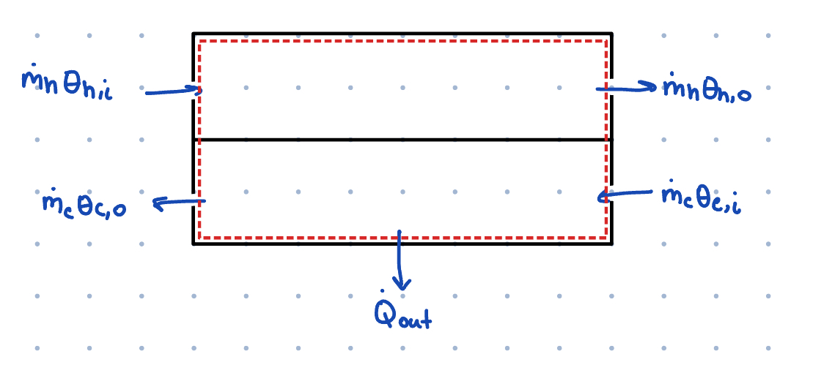
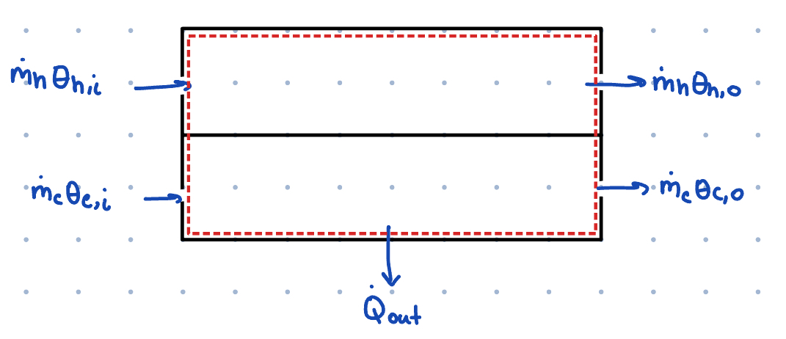

# Heat Exchanger Mini Lab
### Parallel Flow vs Counterflow

## 1. Introduction
For this mini-lab, we examined a small laboratory heat exchanger and compared its performance in **parallel flow** and **counterflow** configurations. The working fluid in all cases was **water** at different inlet temperatures.

---

## 2. Photos & Schematics

Example:

A heat exchanger is a device that transfers heat between two fluid streams without mixing them. In our setup, the two streams were hot water and cold water flowing through two separate channels.

- **Parallel flow:** hot and cold fluids enter from the same side and flow together in the same direction.
- **Counterflow:** fluids enter from opposite sides and flow in opposite directions.  
  Counterflow typically results in greater temperature changes and better overall performance.

Real-world examples of heat exchangers:
- car radiators  
- HVAC systems  
- power plant condensers  
- refrigerator/AC evaporators  
- industrial process cooling

---

## 4. System Diagram

---

## 5. Mass, Energy, and Entropy Balance Equations
Below are the standard balance equations used for this type of steady-flow device.  

### Mass Balance
$$
\dot{m}_{in} - \dot{m}_{out} = 0
$$

### Energy Balance (steady, neglecting KE/PE)
$$
\dot{Q}_{in} - \dot{W}_{out} + \dot{m}_{in} h_{in} - \dot{m}_{out} h_{out} = 0
$$

### Entropy Balance
$$
\dot{S}_{gen} + \dot{m}_{in} s_{in} - \dot{m}_{out} s_{out} = 0
$$

---

## 6. Experimental Data

### **Counterflow**
- Cold inlet: **7.0°C**  
- Hot inlet: **42.5°C**  
- Cold outlet: **24.4°C**  
- Hot outlet: **23.7°C**

Heat exchanger wall temperatures:  
- Initially 307.5 K at hot inlet side  
- Initially 297.5 K at cold inlet side  
- After exchange: 307.5 K at hot inlet side  
- After exchange: 316.6 K at cold inlet side

---

### **Parallel Flow**
- Cold inlet: **5.2°C**  
- Hot inlet: **35.5°C**  
- Cold outlet: **16.4°C**  
- Hot outlet: **19.8°C**

Heat exchanger device temperatures:  
- Hot fluid entrance initially: 297.5 K → 296.8 K after  
- Cold fluid entrance initially: 299.7 K → 292.9 K after

---

## 7. Discussion

### **How design/operating changes affect performance**
We compared parallel flow vs counterflow.  
Counterflow produced a **larger temperature change** and brought both streams closer to one another’s inlet temperature, demonstrating why counterflow is preferred in most real-world systems.

### **Is the heat exchanger adiabatic?**
Probably not — the measured wall temperatures show noticeable changes, indicating heat loss to the surrounding environment.  
Real heat exchangers are insulated to minimize this.

### **Steady state?**
The system likely approached steady state but not perfectly. Temperature drift on the wall suggests some transient effects. Allowing more time or stabilizing flow rates can reduce this.

### **Kinetic Energy Effects**
Kinetic energy changes are negligible for small lab flow rates and are usually ignored in these analyses.

---

## 8. Conclusion
This mini-lab demonstrated the performance differences between parallel and counterflow heat exchanger configurations.  
Counterflow provided better heat transfer effectiveness, while parallel flow produced smaller temperature rises and drops.  
The real-world behavior was influenced by non-adiabatic losses and incomplete steady-state operation.

---
